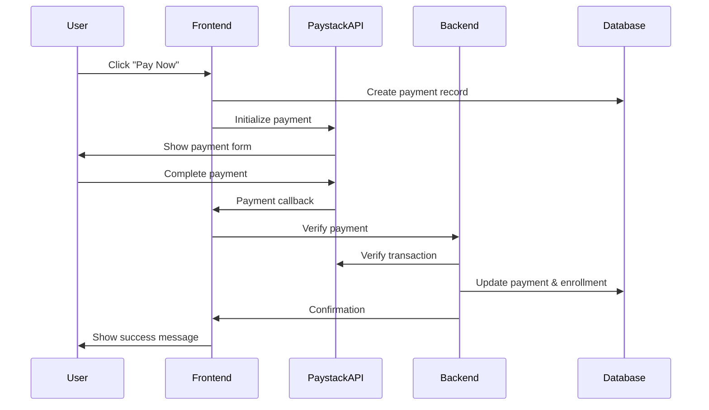

# Paystack Payment Integration for Digitec Learning Platform

This document outlines the complete Paystack payment integration for the Digitec learning platform, enabling users to pay for course enrollments.

## 📋 Overview

The integration includes:
- **Payment processing** via Paystack for course enrollments
- **Database schema updates** to support payments and pricing
- **React components** for payment UI with glassmorphism design
- **API routes** for payment verification and enrollment
- **Security features** and error handling

## 🗄️ Database Changes

### 1. Apply Database Schema Updates

Run the SQL script to add payment functionality:

```sql
-- Execute the contents of src/database/payment_schema_update.sql
```

**Key additions:**
- `price`, `currency`, `is_free`, `payment_required` fields to `sub_courses` table
- New `payments` table to track all payment transactions
- `payment_id` and `payment_status` fields to `sub_course_enrollments` table
- Sample pricing for existing courses (₦15,000 - ₦35,000 range)

### 2. Database Tables Structure

#### Payments Table
```sql
CREATE TABLE payments (
  id UUID PRIMARY KEY,
  user_id UUID REFERENCES auth.users(id),
  sub_course_id UUID REFERENCES sub_courses(id),
  course_id UUID REFERENCES courses(id),
  amount DECIMAL(10,2) NOT NULL,
  currency VARCHAR(3) DEFAULT 'NGN',
  paystack_reference VARCHAR(255) UNIQUE NOT NULL,
  paystack_transaction_id VARCHAR(255),
  payment_status VARCHAR(50) CHECK (payment_status IN ('pending', 'success', 'failed', 'cancelled')),
  payment_method VARCHAR(50),
  payment_date TIMESTAMP WITH TIME ZONE,
  metadata JSONB,
  created_at TIMESTAMP WITH TIME ZONE DEFAULT NOW(),
  updated_at TIMESTAMP WITH TIME ZONE DEFAULT NOW()
);
```

## 🔧 Environment Setup

### 1. Paystack Account Setup
1. Create account at [paystack.com](https://paystack.com)
2. Get your API keys from Dashboard → Settings → API Keys & Webhooks

### 2. Environment Variables
Copy `env.template` to `.env.local` and add your keys:

```env
# Paystack Configuration
NEXT_PUBLIC_PAYSTACK_PUBLIC_KEY=pk_test_your_public_key_here
PAYSTACK_SECRET_KEY=sk_test_your_secret_key_here

# For production, use live keys:
# NEXT_PUBLIC_PAYSTACK_PUBLIC_KEY=pk_live_your_public_key_here
# PAYSTACK_SECRET_KEY=sk_live_your_secret_key_here
```

## 🧩 Components

### 1. PaystackIntegration Component
**Location:** `src/components/PaystackIntegration.js`

Core payment component that:
- Loads Paystack inline script dynamically
- Handles payment initialization and callbacks
- Creates payment records in database
- Provides beautiful glassmorphism UI

**Usage:**
```jsx
<PaystackIntegration
  subCourseId={subCourse.id}
  courseId={course.id}
  amount={subCourse.price}
  currency="NGN"
  onPaymentSuccess={handleSuccess}
  onPaymentError={handleError}
  userEmail={user.email}
  courseName={subCourse.title}
/>
```

### 2. PaymentEnrollment Component
**Location:** `src/components/PaymentEnrollment.js`

Enrollment wrapper that:
- Checks user enrollment status
- Shows appropriate UI (enrolled, free, payment required)
- Integrates with PaystackIntegration component
- Handles enrollment flow

**Usage:**
```jsx
<PaymentEnrollment
  subCourse={subCourse}
  course={course}
  onEnrollmentSuccess={handleEnrollmentSuccess}
  userEmail={user.email}
/>
```

## 🔌 API Routes

### Payment Verification Route
**Location:** `src/app/api/verify-payment/route.js`

Handles:
- Payment verification with Paystack API
- Database updates for successful payments
- Course enrollment creation
- Error handling and security

**Endpoint:** `POST /api/verify-payment`

**Request Body:**
```json
{
  "reference": "digitec_1234567890_123456",
  "subCourseId": "uuid",
  "courseId": "uuid"
}
```

## 🎨 Styling

### CSS Files
- `src/styles/PaystackIntegration.css` - Payment form styling
- `src/styles/PaymentEnrollment.css` - Enrollment UI styling

**Features:**
- Glassmorphism design with backdrop blur
- Responsive design for all devices
- Dark mode support
- Smooth animations and hover effects
- Loading states and error handling

## 💳 Payment Flow

### 1. User Journey
1. User views course → sees pricing
2. Clicks "Enroll Now" → payment form appears
3. Enters details → Paystack popup opens
4. Completes payment → verification happens
5. Success → automatic enrollment + access granted

### 2. Technical Flow


## 🧪 Testing

### Test Cards (Paystack)
Use these test cards in development:

**Successful Payment:**
- Card: `4084084084084081`
- Expiry: Any future date
- CVV: `408`
- PIN: `1234`

**Failed Payment:**
- Card: `4084084084084081`
- Expiry: Any past date

### Testing Checklist
- [ ] Payment form loads correctly
- [ ] Paystack popup opens
- [ ] Successful payment creates enrollment
- [ ] Failed payment shows error message
- [ ] Payment verification works
- [ ] Database records are created
- [ ] User gets access after payment
- [ ] Responsive design works
- [ ] Error handling works

## 🚀 Deployment

### 1. Environment Variables
Set these in your hosting platform (Vercel, Netlify, etc.):
- `NEXT_PUBLIC_PAYSTACK_PUBLIC_KEY`
- `PAYSTACK_SECRET_KEY`

### 2. Production Checklist
- [ ] Switch to live Paystack keys
- [ ] Test with real payments (small amounts)
- [ ] Set up webhook endpoints (optional)
- [ ] Configure proper error logging
- [ ] Test all payment scenarios
- [ ] Verify database permissions

## 🔒 Security Features

### 1. Built-in Security
- Server-side payment verification
- User authentication required
- Database-level constraints
- Input validation and sanitization
- Secure API key handling

### 2. Best Practices
- Never expose secret keys in frontend
- Always verify payments server-side
- Use HTTPS in production
- Implement proper error handling
- Log payment events for auditing

## 📊 Sample Pricing Structure

Current pricing (can be modified in database):

| Course Category | Price Range |
|----------------|-------------|
| Microsoft Office | ₦15,000 |
| Adobe Creative Suite | ₦25,000 |
| Web Development | ₦20,000 - ₦30,000 |
| Forex Trading | ₦35,000 |
| Data Analysis | ₦22,000 |
| UI/UX Design | ₦28,000 |

## 🔧 Customization

### 1. Pricing Updates
Update prices directly in database:
```sql
UPDATE sub_courses 
SET price = 20000.00, currency = 'NGN' 
WHERE title = 'Course Name';
```

### 2. Currency Support
The system supports multiple currencies:
- NGN (Nigerian Naira) - default
- USD (US Dollar)
- GHS (Ghanaian Cedi)
- KES (Kenyan Shilling)

### 3. UI Customization
Modify CSS files to match your brand:
- Colors and gradients
- Border radius and shadows
- Typography and spacing
- Animation timing

## 🐛 Troubleshooting

### Common Issues

**1. Payment popup doesn't open**
- Check if Paystack public key is set
- Verify internet connection
- Check browser console for errors

**2. Payment verification fails**
- Verify secret key is correct
- Check API route is accessible
- Review server logs for errors

**3. Enrollment not created**
- Check database permissions
- Verify user authentication
- Review payment verification logic

**4. Styling issues**
- Ensure CSS files are imported
- Check for conflicting styles
- Verify responsive breakpoints

### Debug Mode
Enable debug logging by adding to your component:
```javascript
console.log('Payment debug:', {
  amount,
  reference,
  userEmail,
  subCourseId
});
```

## 📞 Support

For issues with:
- **Paystack integration:** Check [Paystack documentation](https://paystack.com/docs)
- **Database issues:** Review Supabase logs and policies
- **Component issues:** Check browser console and React dev tools

## 🔄 Future Enhancements

Potential improvements:
- [ ] Webhook implementation for real-time updates
- [ ] Subscription-based pricing
- [ ] Discount codes and coupons
- [ ] Bulk course purchases
- [ ] Payment analytics dashboard
- [ ] Refund handling
- [ ] Multiple payment methods
- [ ] Installment payments

---

**Note:** This integration is production-ready but should be thoroughly tested in your specific environment before going live. Always use test keys during development and switch to live keys only for production.
